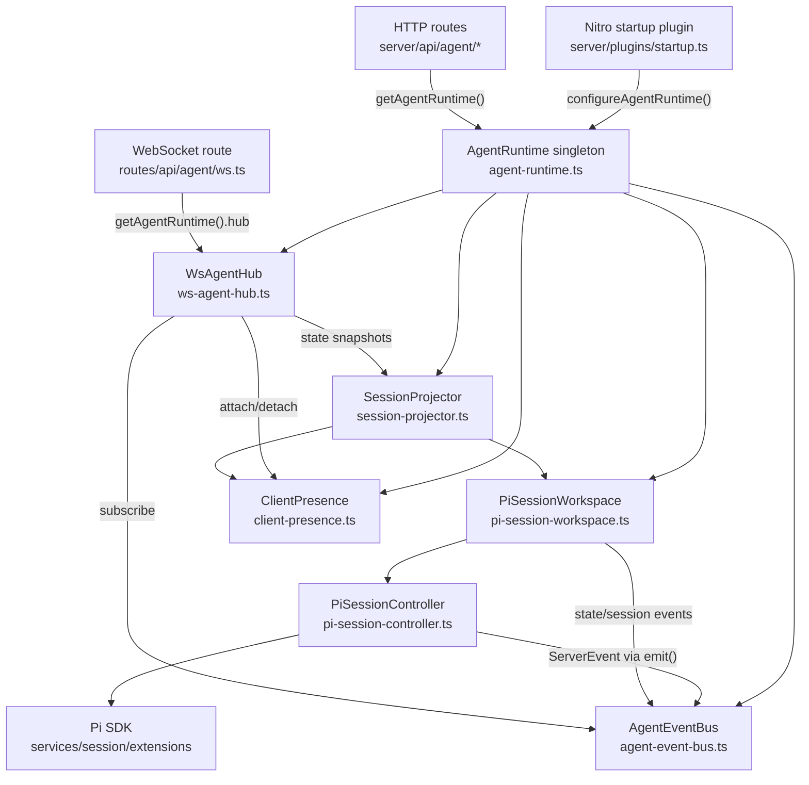
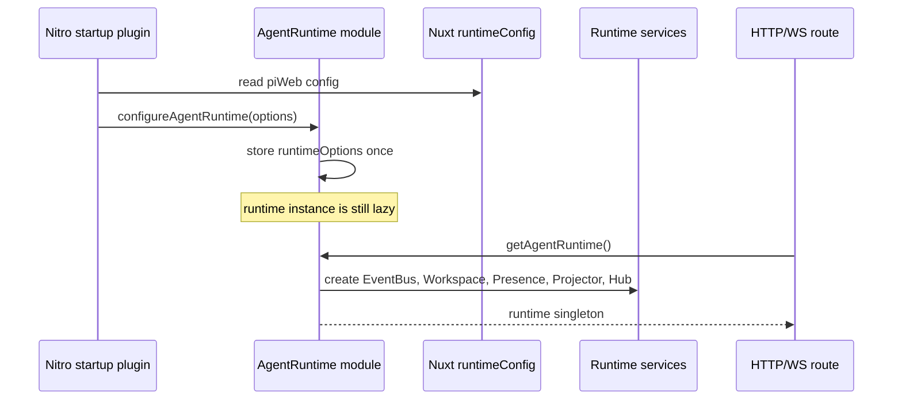
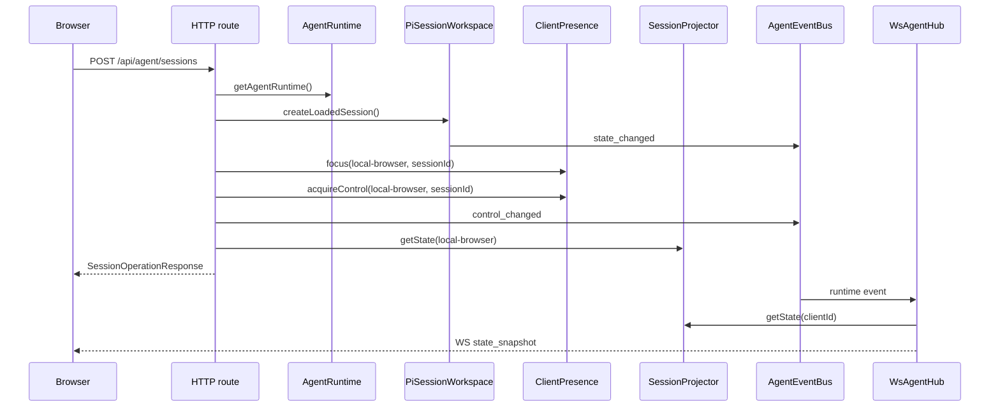
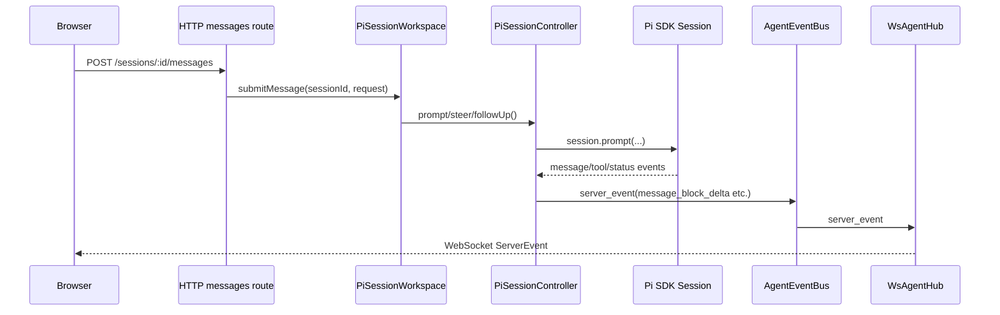
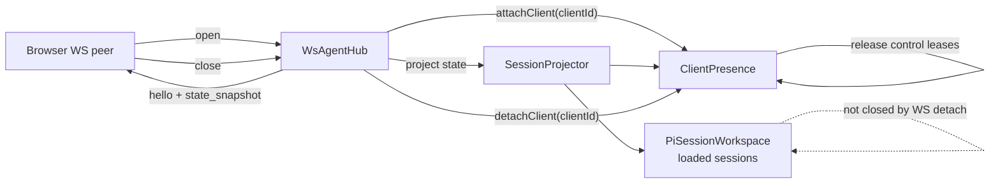
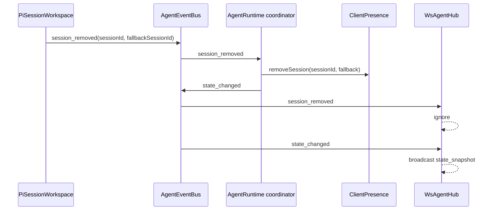

# Server Runtime Architecture

This document visualizes the current Agentaz server runtime structure and data flow.

## Service Structure



## Startup And Singleton Initialization



## HTTP Action Flow



## Pi Session Streaming



## WebSocket Attach And Detach



## Session Removed Coordination



## Responsibility Summary

```txt
HTTP routes:
  - get the runtime
  - call workspace/presence/projector
  - do not manage WebSocket peers

WsAgentHub:
  - owns peers, heartbeat, and event forwarding
  - does not create or close Pi sessions

PiSessionWorkspace:
  - owns Pi SDK services and loaded sessions
  - does not know client ids or peers

ClientPresence:
  - owns client focus and control leases
  - does not know Pi SDK controllers

SessionProjector:
  - projects workspace + presence into protocol DTOs
```
